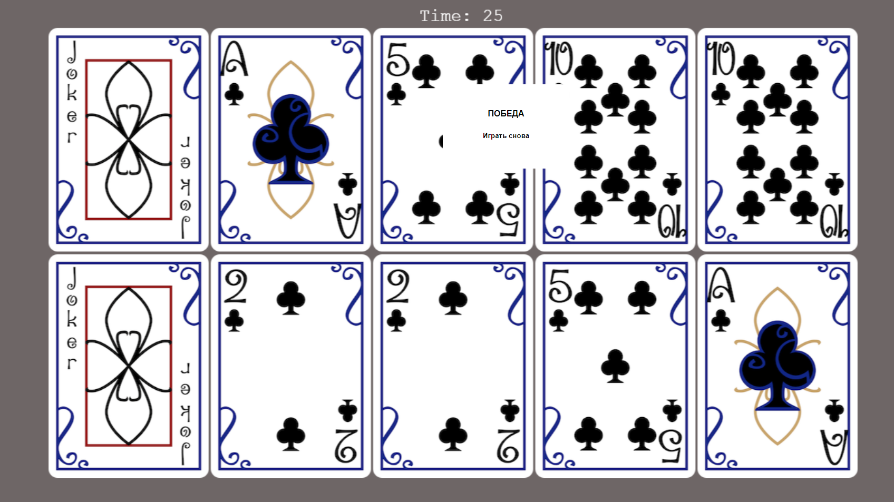

# Card Memory Game

Карточная браузерная игра (memory)

## Функционал

За отведенное время (40 секунд), игроку предлагается 
10 карт, лежащих рубашкой вверх 

При клике на карту можно посмотреть ее лицевую сторону

Задача путем переворота карт отыскать все пары.



## Технологии
Phaser.js
WebPack
TypeScript


### Для запуска проекта:

Важно иметь Node Packet Manager последней стабильной версии

```
npm install
```

### static server

```
npm run start
```

### build

```
npm run build
```

### develop

```
npm run develop
```
Приложение будет запущено на порту 9001


### Улучшения:
Возможно улучшить верстку, добавить адаптивную верстку \
Решить проблему с кодировщиком UTF-8